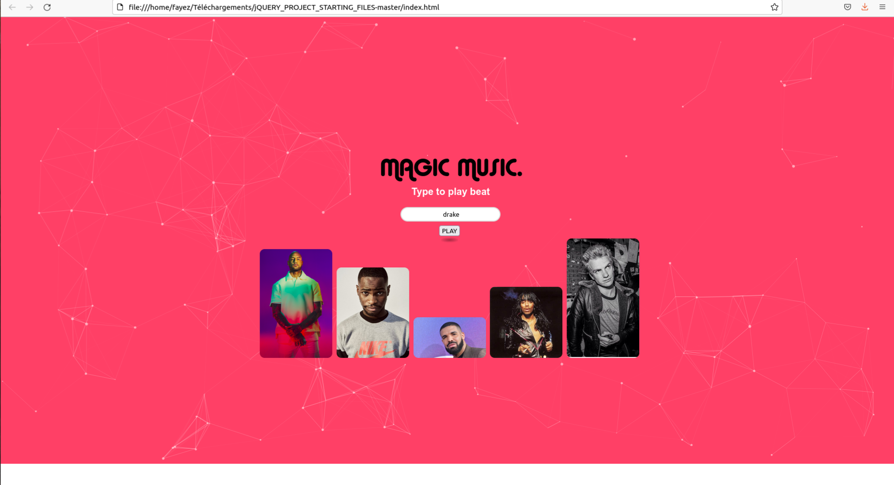

# jQUERY_js
using framework jQUERY in Javascript
 Click on keyboard letters changes the background color 
and  Click on the image of the artist it creates the music of the artists and its name
write the name of the artist on the input it create his music

